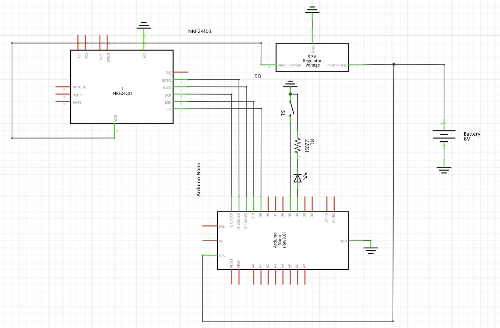

## Game Show Buzzer System
Wireless Arduino Nano / NRF24l01 Buzzer system with Game-Master to reset the buzzer states. Only one Buzzer can "win". Each Buzzer trigger can have it's own audio playback.

*watch the demonstration video*

### Master / Wav-Player
The game master controls the buzzers. It receives signal from the pressed buzzers and determines, who wins the race. The winner receives the "light on" signal. Optional you can add a Wav-Player, to support a buzzer sound on success.

[Source code for master](NF24-BK-MASTER/NF24-BK-MASTER.ino)

[Source code for wav-player](NF24-BK-WAVPLAYER/NF24-BK-WAVPLAYER.ino)

#### Circuit Layout

*note: the wave-player circuit layout is not included*

**Install**
- Copy NF24* to your your Arduino folder
- Install library [RF24 by TMRh20](http://tmrh20.github.io/RF24/)
- (optional) Install Library [TMRpcm for wav-player](https://github.com/TMRh20/TMRpcm)

**Parts** (Master)
- Arduino Nano
- NRF24l01
- Touch Button (to reset lock)

**Parts** (Wav-Player) - optional
- Arudino Nano
- SDCard Reader for Arduino

### Buzzer
The buzzer sends a button press to the master. Only if the buzzer "wins", the buzzer receives the command to turn on the light.

[Source code for the buzzer](NF24-BK-BUZZER/NF24-BK-BUZZER.ino)

**Parts**
- Arduino Nano
- NRF24l01
- LED (buzzer light)
- Touch Button (buzzer)
